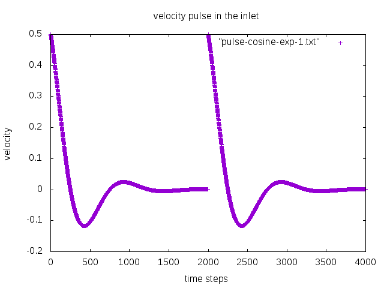

# Pulses 

```c
  vel_u = (cos(omegapul * tpul) * exp (-tpul * taupul)) / npul;
```

### 1 
```c
const double freq = 4000.0;
const int period = 4000.0;
const double npul = 2;
const double taupul = 0.5;
double tpul;
const double omegapul = 1;
const double cycle = 4;
```

